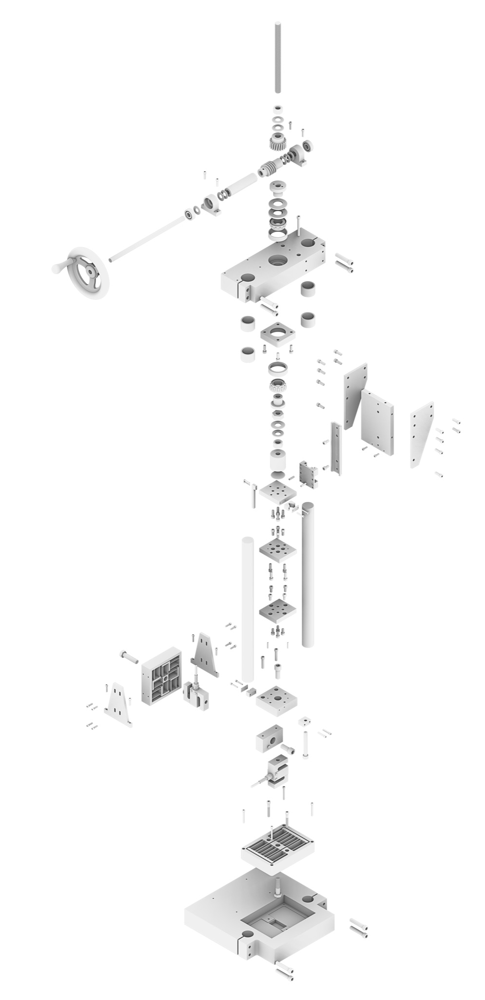

A precision instrument designed to measure the full 2D stiffness matrix of flexure specimens, built as part of MIT's 2.77 Precision Product Design course (Fall 2021) by team FACTuators: Dylan Fife, Qiyun Gao, Ben Hamilton, Zain Karsan, and ZhiYi Liang.

<!--more-->

The machine characterizes flexure stiffness over a range of 10⁻¹ to 10¹ N/μm in the stiff (Z) direction and 10⁻² to 10⁰ N/μm in the compliant (X) direction, with a maximum force delivery of 10 kN and 6.5 mm of travel.

## Mechanical Design

Force is delivered through a hand-crank driving a 10:1 worm gear into a 5/8-8 ACME lead screw, converting a modest hand torque (~5 Nm) into up to 10 kN of axial load at 0.3 mm displacement per handle turn. The entire drivetrain was designed with a minimum safety factor of 2.

## Metrology Frame

A dedicated metrology frame decouples force and displacement measurements from machine compliance. Z and X forces are measured by 1000 kgf and 300 kgf load cells respectively, with cross-axis coupling rejected by flexures with >100:1 relative stiffness. Displacement is measured by dial indicators directly at the specimen interface.

## Data Acquisition

Load cell signals (2 mV/V full scale) are amplified by INA128 instrumentation amplifiers at a gain of 185, then sampled by an AD7606 16-bit ADC via a Teensy 3.2 microcontroller over SPI. A MATLAB interface provides live plotting with a 200 ms sliding window average and zeroing capability.

## Validation

The machine was successfully tested to 9.5 kN in the Z-axis. Stiffness measurements on straight and slanted blade flexure specimens agreed with FEA predictions within the reported 95% confidence intervals.
