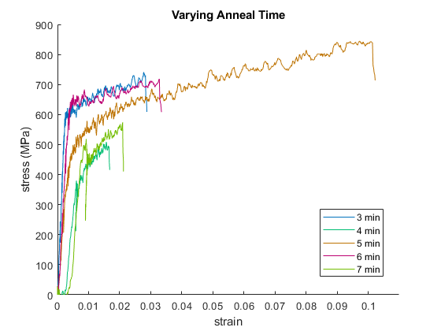
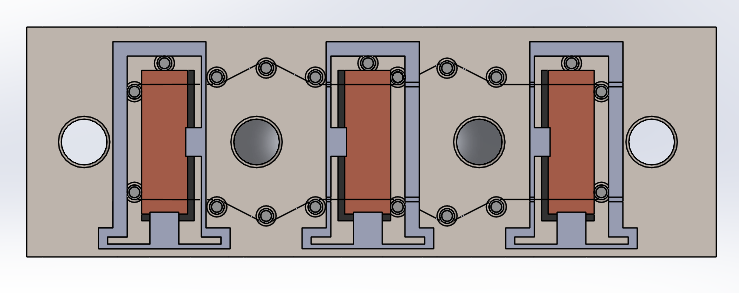

A high-Q mechanical resonator was fabricated by fusion bonding copper wires to copper paddle structures. A custom bonding jig was designed to perform the process reliably, and wire annealing conditions were characterized to optimize mechanical properties prior to bonding.

<!--more-->



## Wire Annealing

Before bonding, bare copper wires were heat treated at 900 °C for varying durations to characterize the effect of anneal time on mechanical properties. Stress-strain curves were measured for annealing times from 3 to 7 minutes.

Longer annealing times produced wires with significantly greater ductility and higher ultimate tensile strength — the 5-minute anneal achieved ~800 MPa before fracture with over 10% strain, compared to wires that broke below 3% strain at shorter times. These measurements informed the choice of annealing parameters used for the final bonded assembly.

## Fusion Bonding Jig

A custom stainless steel jig was designed and machined to perform the fusion bonding at 900 °C. The jig served four functions: applying sufficient pressure to each paddle, aligning wires to paddles, preventing adhesion between the jig and the copper, and protecting the wires from breakage during assembly and disassembly.

**Pressure application:** Four bolts loaded through Inconel 718 Belleville spring washers delivered clamping force to the paddles. Because the Inconel springs creep at 900 °C — losing roughly half their stiffness — the room-temperature preload was set to 20 MPa to ensure at least 10 MPa remained at bonding temperature. The spring washers also accommodated up to 0.25 mm of differential thermal expansion between graphite and steel without releasing the load.

**Alignment:** Wires were held taut around locating pins during assembly. Paddles were registered against the same pins, ensuring consistent wire-to-paddle alignment across all bond sites.

**Anti-stick layer:** Solid graphite blocks were placed between the stainless steel outer plates and the copper paddles. Graphite does not bond to either material and, due to its lower coefficient of thermal expansion than steel, maintained contact pressure throughout the thermal cycle.

**Wire protection:** The top plate incorporated cutout slots that allowed the wire-tensioning pins to be removed after the outer plates were fully bolted down. Once the wires were captured between the paddles, the tensioning pins were withdrawn, leaving slack in the wire spans between paddle sites. This slack prevented wire breakage during disassembly — a failure mode encountered in earlier bonding attempts.

## Bonding Results

The bond was successful. All paddles released cleanly from the graphite blocks with no adhesion, and all wires survived disassembly intact — a direct result of the stress-relieving pin slack. The jig and wires showed some surface oxidation from the heat treatment being performed in open air. The video above shows the released paddles hanging freely in the lab.

**Bolt removal:** In earlier tests, the jig top and bottom plates spun relative to each other when unbolting, ripping wires. A custom soft jaw was printed to grip the jig body during bolt removal, eliminating this failure mode entirely.

**Bolt anti-sticking treatments:** Several strategies were tested to prevent bolts, washers, and nuts from bonding to the jig at 900 °C. Mica sheet placed between the washers and the jig plates prevented washer adhesion cleanly. For the nuts, ceramic nuts and an oiled stainless steel nut (Kroil penetrating oil) were compared. The ceramic nuts did not bond to the bolts, but two of the four shattered after the thermal cycle and are not recommended for future use. The oiled stainless nut was only weakly adhered and posed no practical problem; oiled steel nuts were adopted as the standard going forward.
