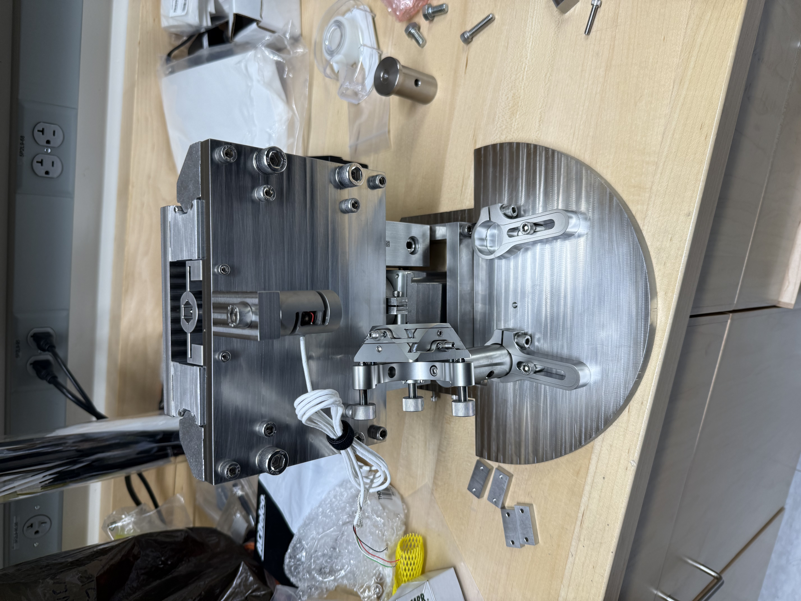
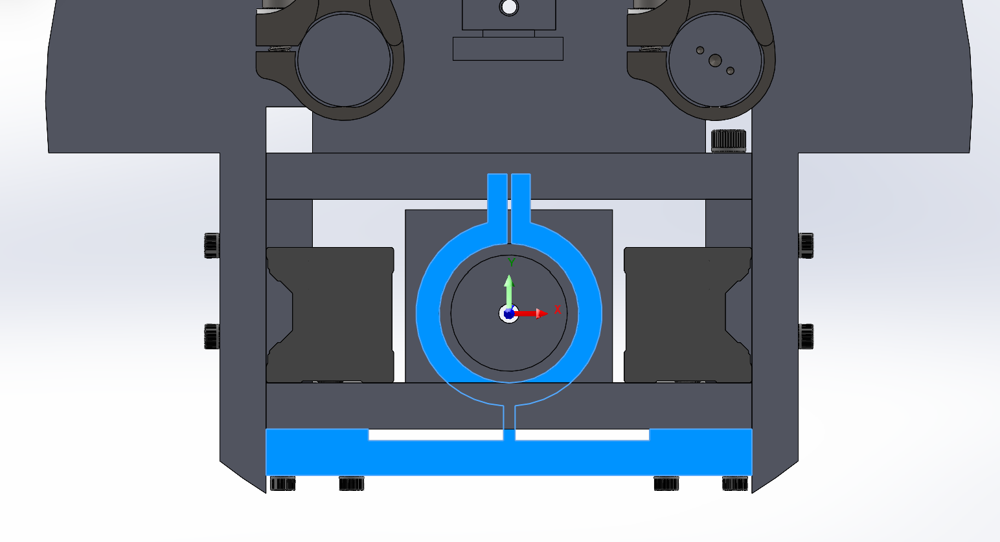
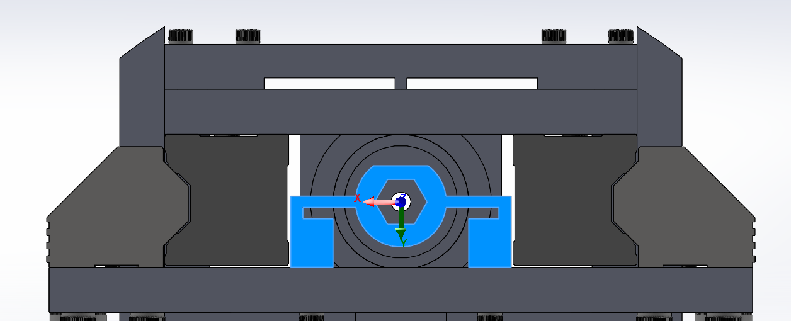
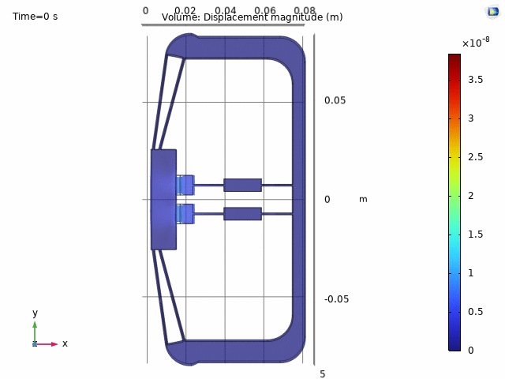

A ultra-high vacuum (UHV)-compatible stage for applying and measuring tension in wire resonators. All components have been machined and the system is currently being cleaned prior to final assembly.

<!--more-->

The stage has four main subsystems: an optical shadow sensor, a precision linear rail, a piezoelectric actuator on compliance flexures, and a wire clamp mount.

## Optics

Shadow sensing was used to measure wire position. Initial testing with multimode fiber on both sides revealed a non-Gaussian beam profile unsuitable for shadow sensing, which requires a monotonically non-increasing intensity profile. The input side was therefore switched to single-mode fiber, with multimode fiber retained on the output side after the wire.

The input beam is collimated to an 800 µm diameter using a 5 mm focal length collimator on a 5-axis Polaris mount. The output side uses the same collimator on a tip-tilt mount. A 0.25" post spacer on the output side compensates for the height difference between the optical axes of the two mounts.

## Rail

A commercial crossed-roller rail from Franke GmbH carries the carriage that holds the top of the wire under test and an integrated strain gauge force transducer. The rail alignment requirement is 50 µm/m; over the ~0.2 m rail length this corresponds to 10 µm of parallelism. Rails were installed progressively and tightened incrementally to allow self-alignment.

## Actuator

The piezoelectric actuator drives the carriage vertically to apply tension to the wire. Because the actuator is mechanically weak in shear, it is isolated from off-axis loads by a pair of flexures — one at the top of the device (Y-axis) and one at the base (X-axis) — that are compliant in directions perpendicular to the actuation axis.

The bottom flexure clamps to the actuator body via a shaft-collar arrangement; the top is secured with a set screw. Machining the flexures required custom 3D-printed fixture jigs to suppress resonances during cutting. The actuator clamp was successfully fitted after the jigs were incorporated into the workflow.

## Wire Mount

The wire mount consists of a piezoelectric element bonded with epoxy to a stainless steel clamp, which is tightened onto the wire with screws. The piezo provides a means of driving ringdown measurements for mechanical quality factor characterization.

## Machining and UHV Compatibility

Most structural components were waterjetted from stainless steel and post-processed for mounting holes. All blind holes were tapped with form taps rather than cutting taps to avoid leaving chips at the bottom — a particular concern in vacuum systems where trapped chips present a large off-gassing surface area. Blasocut UHV-compatible cutting oil, which is miscible in water, was used throughout all machining operations.
